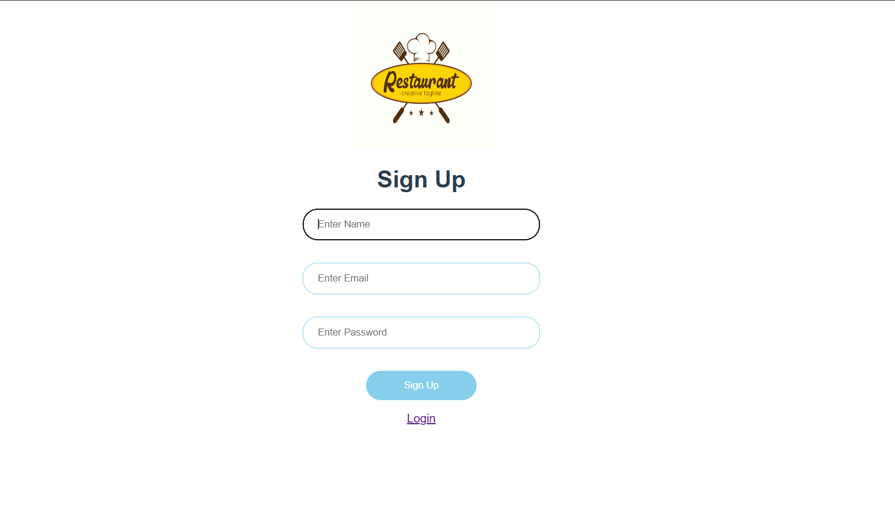
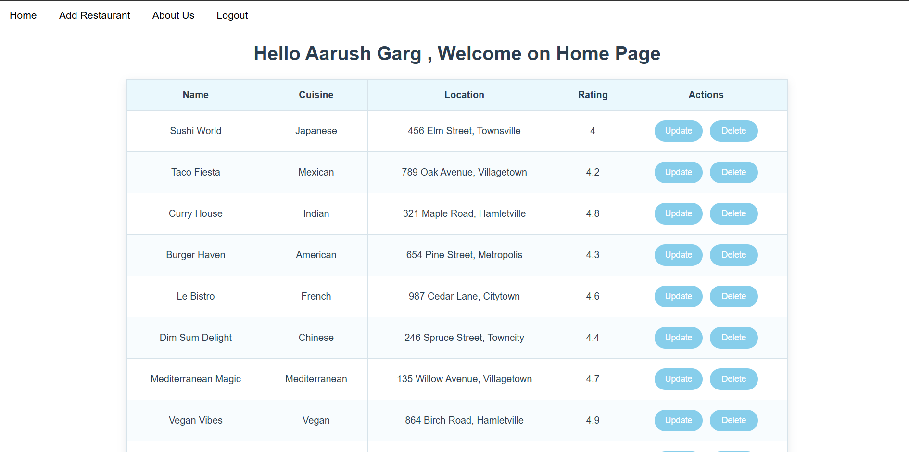
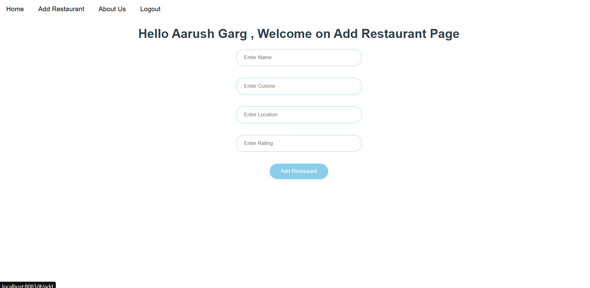
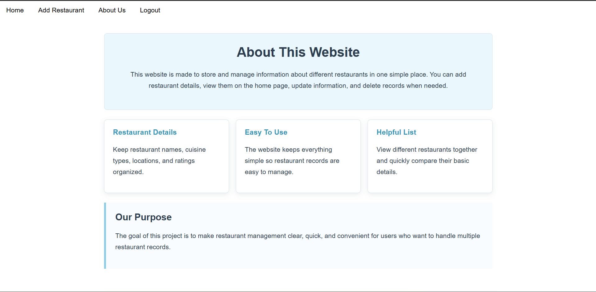

# Resto Project

Resto Project is a Vue.js restaurant management app. It lets users sign up, log in, view restaurant records, add new restaurants, update existing restaurant details, delete restaurants, and read a simple About page for the website.

## Screenshots

### SignUp Page



### Home Page



### Add Restaurant Page



### About Us Page



## Features

- User sign up and login
- Protected app pages using `localStorage`
- Home page with a centered restaurant table
- Add restaurant form
- Update restaurant form by restaurant id
- Delete restaurant action
- Simple About Us page explaining the website
- Navigation header for Home, Add Restaurant, About Us, and Logout

## Tech Stack

- Vue 3
- Vue Router 4
- Axios
- Vue CLI
- ESLint
- JSON Server style REST API

## Project Structure

```text
src/
  App.vue
  main.js
  routers.js
  assets/
    restaurant-logo-design-vector.jpg
  components/
    AboutUs.vue
    Add.vue
    Header.vue
    Home.vue
    Login.vue
    SignUp.vue
    Update.vue
```

## Routes

| Route | Page |
| --- | --- |
| `/` | Home page |
| `/home` | Home page alias |
| `/sign-up` | Sign up page |
| `/signup` | Sign up page alias |
| `/login` | Login page |
| `/add` | Add restaurant page |
| `/update/:id` | Update restaurant page for a specific restaurant |
| `/about-us` | About Us page |

## API Requirements

The app expects a REST API running at:

```text
http://localhost:3000
```

It uses these endpoints:

```text
GET    /restaurants
GET    /restaurants/:id
POST   /restaurants
PUT    /restaurants/:id
DELETE /restaurants/:id
GET    /users?email={email}&password={password}
POST   /users
```

Example `db.json` for JSON Server:

```json
{
  "users": [
    {
      "id": 1,
      "name": "Aarush Garg",
      "email": "aarush@example.com",
      "password": "123456"
    }
  ],
  "restaurants": [
    {
      "id": 1,
      "name": "Sushi World",
      "cuisine": "Japanese",
      "location": "456 Elm Street, Townsville",
      "rating": 4
    }
  ]
}
```

Start JSON Server with:

```bash
npx json-server --watch db.json --port 3000
```

## Project Setup

Install dependencies:

```bash
npm install
```

Start the Vue development server:

```bash
npm run serve
```

The app usually runs at:

```text
http://localhost:8080
```

If port `8080` is busy, Vue CLI may use another port such as `8081`, `8082`, or `8083`.

## Available Scripts

Compile and hot-reload for development:

```bash
npm run serve
```

Build for production:

```bash
npm run build
```

Lint the project:

```bash
npm run lint
```

## Authentication Flow

- Sign up stores the created user in `localStorage` as `user-info`.
- Login checks the `/users` endpoint and stores the matched user in `localStorage`.
- Home, Add, Update, and About Us pages redirect to Sign Up if no user is logged in.
- Logout clears `localStorage` and redirects to Login.

## Notes

- Keep the API server running on port `3000` while using the app.
- Restaurant records should include `name`, `cuisine`, `location`, and `rating`.
- The update page depends on the restaurant id from `/update/:id`.
